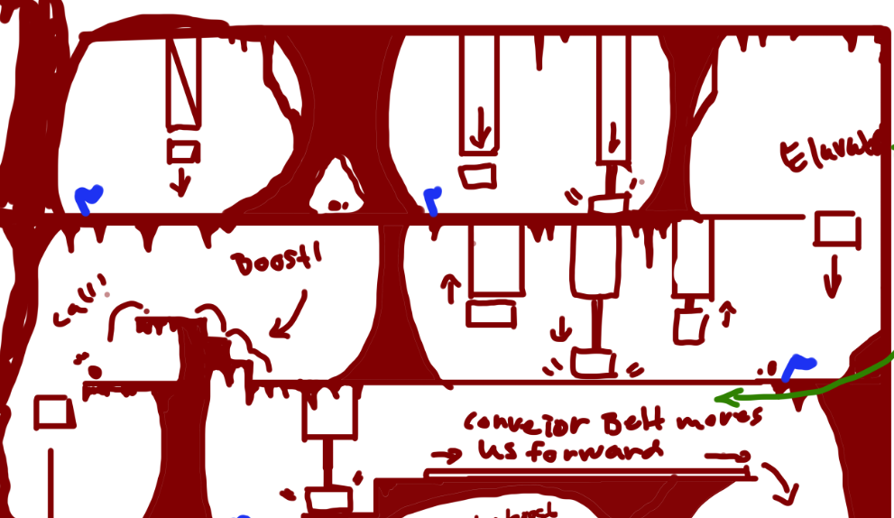
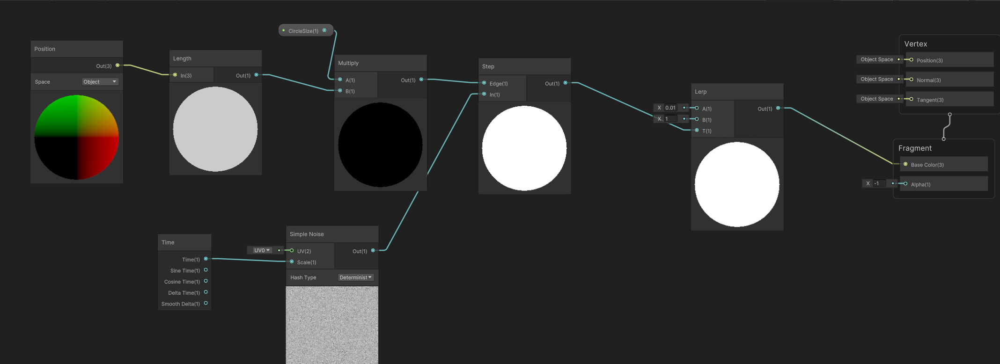

# Parenthood


[Itch.io](https://yrgo-game-creator.itch.io/parenthood)

<br/>

## Game Description
PARENTHOOD explores the need to protect what is innocent and vulnerable. It tells you the story of love and growth, without a single word spoken.
<br/>
### Personal comment
I'm not very proud of the level of programming that i did in this game. However, it was very early in my coding journey and it was essential for learning.
<br/>

# My Contributions During Development

## The child
So there were many challenges with making the movement of the child that will follow you while still acting like a child. With the obstacles there is also a need for situational behaviour depending on which obstacle was ahead. As the first proper project, this ended up being quite challenging.

| A sketch of obstacles | |
|---|---|
|In the beginning, it was expected that the child can move properly and expect help from you, the parent, just like in the sketch made by Axel Björkman. <br/><br/> Some of the obstacles are:<br/> Jump up on ledge with help from parent. <br/> Stop at crushers giving the parent a chance to save the child. <br/> And child running away through a passage giving the parent a limited time to complete a task.| <br/> |

<br/>
<br/>

### The Ledges:
|||
|---|---|
| As quite newbie to coding the first idea that came to mind was to use RayCast to decide if the child was close enough to the step and after that use AddForce to make the child leap upwards over and over so that eventually the child clears the stairs. <br/> This of course is very flawed in many ways. The steps in every map varied in size making it difficult to predict the amount of force needed. It also could make the child stuck if it lands too far into each step.| |

| Simpler but better | |
|---|---|
| There were some more versions before this but in the end i decided that simpler was better and laid out points for each landing per each step. There were some minor things that needed fixing aswell. For example, the childs random jumping needed to be stopped before the approach of the steps. | <br/>|
<details>
<summary>LedgeJumpScript</summary>

```C# 
    private Follow follow;
    private SquishAndStretch squishAndStretch;
    private SpriteRenderer sprite;
    private RaycastHit2D stepRay;

    private int jumpIndex = 0;
    private List<Vector3> childrenPositions = new List<Vector3>();

    [SerializeField] private LayerMask childJumpStepLayer;

    private float maxRaycastDistance = 4f;
    private float jumpDistanceThreshold = 0.3f;

    float stepDistance;
    private bool isJumpInProgress = false;
    public bool smallStepRay = false;

    void Start()
    {

        squishAndStretch = GetComponent<SquishAndStretch>();
        follow = GetComponent<Follow>();
        sprite = GetComponentInChildren<SpriteRenderer>();
    }

    void Update()
    {
        RayCast();

        if (stepRay.collider != null)
        {
            smallStepRay = true;
            follow.canJump = false;
            StartCoroutine(StartProcessCoroutine());
        }
        else
        {
            smallStepRay = false;
        }
    }

    private IEnumerator StartProcessCoroutine()
    {
        yield return new WaitForEndOfFrame(); 
        follow.canJump = false;
        if (!isJumpInProgress)  
        {
            InitiateJump();
        }
    }

    private void RayCast()
    {
        stepRay = Physics2D.Raycast(transform.position, Vector2.right * (sprite.flipX ? -1f : 1f), maxRaycastDistance, childJumpStepLayer);
        stepDistance = Mathf.Abs(stepRay.point.x - transform.position.x);

        if (stepRay.collider != null)
        {
            Transform parentTransform = stepRay.collider.transform;
            childrenPositions.Clear();

            foreach (Transform childTransform in parentTransform)
            {
                Vector3 childPosition = childTransform.position;
                childrenPositions.Add(childPosition);
            }
        }
    }


    private void InitiateJump()
    {
        if (jumpIndex < childrenPositions.Count)
        {
            if (stepDistance < jumpDistanceThreshold && follow.isGrounded)
            {
                Sequence sequence = DOTween.Sequence();
                isJumpInProgress = true; 
                for (int i = 0; i <= childrenPositions.Count; i++)
                {
                    squishAndStretch.enabled = false;
                    sequence.Append(transform.DOJump(childrenPositions[i], 0.15f, 1, 0.4f));
                    jumpIndex++;
                    if (jumpIndex >= childrenPositions.Count)
                    {
                        squishAndStretch.enabled = true;
                        Kill();
                        childrenPositions.Clear();
                        isJumpInProgress = false;
                        jumpIndex = 0;
                    }
                }
            }

        }
        else
        {
            isJumpInProgress = false;
        }
    }


    private void OnDisable()
    {
        Kill();
    }

    private void Kill()
    {
        if (squishAndStretch != null)
        {
            squishAndStretch.enabled = true;
        }
        transform.DOKill();
    }

    private void OnCollisionEnter2D(Collision2D collision)
    {
        if (collision.gameObject.layer == 11 && isJumpInProgress)
        {
            StopCoroutine(StartProcessCoroutine());
            Kill();
            childrenPositions.Clear();
            isJumpInProgress = false;
            jumpIndex = 0;
        }
    }

```
</details>

<br/>
<br/>

### Assisted Jumps:
|Same as before||
|---|---|
|Similiar to the steps like before, there was another step for the child where it was too high for it to reach. For the child to make it over, the child needed help from the player/parent. <br/><br/> Before this task, we were taugh what DOTween was which help immensely with the solution. For this task i decided to check if the parent was next to the wall and then getting the top position of the parents collider. With that i made the child "jump" from it's original position to the top of the parent and after that using a bit of AddForce to make it completely over the ledge. | |

<details>
<summary>AssistedJumpScript</summary>

```C# 
    private Rigidbody2D rb;
    private MotherMovement motherMovement;
    private ChildJumpOverSmall childJumpOverSmall;
    private Follow follow;
    private SpriteRenderer sprite;
    RaycastHit2D hitInfo;

    [SerializeField] private LayerMask parentLayer;

    private float maxRaycastDistance = 9f;
    private float jumpDistanceThreshold = 0.2f;
    

    Vector2 topCenter;
    private bool hasTestBeenCalled = false;
    private float distance;
    private float originalStoppingDistance;


    void Start()
    {
        follow = GetComponent<Follow>();
        motherMovement = FindAnyObjectByType<MotherMovement>();
        rb = GetComponent<Rigidbody2D>();
        sprite = GetComponentInChildren<SpriteRenderer>();
        childJumpOverSmall = GetComponent<ChildJumpOverSmall>();
        originalStoppingDistance = follow.stoppingDistance;
    }

    void Update()
    {
        RayCast();

        if (motherMovement.wallCheck)
        {
            follow.canJump = false;
            follow.movingLeft = false;
            follow.movingRight = false;
            if (motherMovement.IsGrounded() && !hasTestBeenCalled)
            {
                follow.stoppingDistance = 0f;
                follow.isFollowing = true;
                if (distance < jumpDistanceThreshold && follow.isGrounded)
                {
                    JumpOnParent();
                    follow.isFollowing = false;
                    hasTestBeenCalled = true;
                }
            }
        }
        else if (childJumpOverSmall.smallStepRay == false)
        {
            follow.canJump = true;
        }

        if (!motherMovement.wallCheck && hasTestBeenCalled)
        {
            Kill();
            hasTestBeenCalled = false;
            follow.isFollowing = false;
        }

    }

    private void RayCast()
    {
        hitInfo = Physics2D.Raycast(transform.position, new Vector2((sprite.flipX ? -1f : 1f), 0), maxRaycastDistance, parentLayer);
        var parentCollider = hitInfo.collider;
        distance = Mathf.Abs(hitInfo.point.x - transform.position.x);
        if (parentCollider != null)
        {
            topCenter = new Vector2(parentCollider.bounds.center.x, parentCollider.bounds.max.y);
        }
    }

    private void OnCollisionEnter2D(Collision2D collision)
    {

        if (collision.gameObject.layer == 11)
        {
            follow.isFollowing = false;
            follow.stoppingDistance = originalStoppingDistance;
            if (transform.position.y > follow.target.position.y && motherMovement.wallCheck)
            {
                CancelInvoke("Timer");
                hasTestBeenCalled = true;
                Invoke("Timer", 2);
                Kill();
                rb.velocity = Vector2.zero;
                float jumpForceX = sprite.flipX ? -0.5f : 0.5f;
                rb.AddForce(new Vector2(jumpForceX, 4f), ForceMode2D.Impulse);
            }
        }
    }

    private void JumpOnParent()
    {
        rb.velocity = Vector2.zero;
        transform.DOJump(topCenter, 0.3f, 1, 1).OnComplete(Kill);

    }

    private void Timer()
    {
        hasTestBeenCalled = false;
    }
    private void OnDisable()
    {
        Kill();
    }

    private void Kill()
    {
        transform.DOKill();
    }

```
</details>

<br/>
<br/>

### Crushers:

|Protecting the child||
|---|---|
|We also wanted a obstacle that was dangerous instead of a simple step that the child can't jump over. Instead of adding something brutal like blades a simple crusher like in mario seemed like a good option. It was quite tricky to make it feel satisfying to save the child but i'm glad with the result.  | |

<details>
<summary>CrusherScript</summary>

```C#
    private Rigidbody2D rb;
    public GameObject pointA;
    public GameObject pointB;
    private bool isGoingUp = false;
    private bool canHurtChild = false;
    private bool hitPlayer = false;

    private CheckpointManager checkpointManager;    
    private void Start()
    {
        rb = GetComponent<Rigidbody2D>();
        checkpointManager = FindObjectOfType<CheckpointManager>();
    }

    private void Update()
    {
        if (isGoingUp)
        {
            canHurtChild = false;
            MoveUpToPointA();
        }
        else if (!isGoingUp && !hitPlayer)
        {
            canHurtChild = true;
            MoveUpToPointB();
            
        }
        
    }

    private void MoveUpToPointA()
    {
        Vector2 direction = (pointA.transform.position - transform.position).normalized;
        rb.velocity = new Vector2(rb.velocity.x, direction.y * 2);

        if (transform.position.y >= pointA.transform.position.y - 0.2f)
        {
            rb.velocity = Vector2.zero;
            isGoingUp = false;
        }
    }

    private void MoveUpToPointB()
    {
        
        Vector2 direction = (pointB.transform.position - transform.position).normalized;
        rb.velocity = new Vector2(rb.velocity.x, direction.y * 50);
        
        if (transform.position.y <= pointB.transform.position.y)
        {

            StartCoroutine(WaitAndMoveUp());
        }
    }

    private IEnumerator WaitAndMoveUp()
    {
        canHurtChild = false;
        rb.velocity = Vector2.zero;
        yield return new WaitForSeconds(2);
        hitPlayer = false;
        isGoingUp = true;
    }


    private void OnCollisionStay2D(Collision2D collision)
    {
        
        if (collision.gameObject.CompareTag("child") && canHurtChild)
        {
            checkpointManager.LoadCheckpoint();
            CinemachineShake.Instance.ShakeCamera(1f, 0.5f);
      
        }
        if (collision.gameObject.CompareTag("Player") && canHurtChild)
        {
            hitPlayer = true;
            StartCoroutine(WaitAndMoveUp());
            CinemachineShake.Instance.ShakeCamera(1f, 0.5f);
        }
    }
```
</details>

## 

## "Lonely" Shader
Due to there being some of play testers simply leaving the child and going ahead alone i decided to add something to discourage such actions. Since it was the early days of my game development journey i thought it would be fun to try out some shaders for the first time.

|First time using shaders||
|---|---|
|Although this shader isn't Shadertoy.com level it was enough to give the message to the player that they should go back. <br/><br/>  It calculates the position of the pixels from the origin and with a variable i increase or decrease the size of the mask i apply. A simple circle is a bit boring so i add some noise with a time node connected to the scale of the noise creating some variation. | |

<details>
<summary>Shader Graph</summary>

</details>

## Cinematic Bars and transition
Something smaller i did was the transitions between the cinematic and actual gameplay. I also did the letterboxing for each cutscene making it easier to see when a cinematic actually starts.


|||
|---|---|
|This one was quite simple. I created two 2D blocks and simply moved them up or down in an animation depending on if the cinematic started or ended. <br/> <br/> As for the transition from cinematic to gameplay, i had two different gameobjects for each charachter, two for the child and two for the parent. Right before the cutscene ended i made sure the "real" parent and child was in the position of the cutscene parent and child and then seemlessly switched active state of the two and the cameras. |  <br/> (The cinematic parent and child is not in the gif due to time restraint.)|

<details>
<summary>CinematicBarsController</summary>

```C#
    public static CinematicBarsController Instance { get; private set; }
    private GameObject cinematicBarContainerGO;
    private Animator animator;

    public void Start()
    {
        GameObject[] foundObjects = Resources.FindObjectsOfTypeAll<GameObject>().Where(obj => obj.name == "CinematicBarsContainer").ToArray();

        if (foundObjects.Length > 0)
        {
            cinematicBarContainerGO = foundObjects[0];
        }
        animator = cinematicBarContainerGO.GetComponent<Animator>();


    }
    public void ShowBars()
    {
 
        cinematicBarContainerGO.SetActive(true);
        

    }

    public void HideBars()
    {
        if (cinematicBarContainerGO.activeSelf)
        {
            StartCoroutine("HideBarsAndDisable");
        }
    }

    private IEnumerator HideBarsAndDisable()
    {
        animator.SetTrigger("HideCinematicBars");
        yield return new WaitForSeconds(3);
        cinematicBarContainerGO.SetActive(false);
    }
```
</details>

<details>
<summary>IntroScript (Methods activated in animation, not proud of this one.)</summary>

```C#
  public GameObject child;
  public GameObject parent;
  public GameObject cutSceneChild;
  public GameObject cutSceneParent;
  public CinemachineVirtualCamera introVirtualCamera;
  private Follow follow;
  private MotherMovement motherMovement;
  public SceneHandler sceneHandler;
  void Start()
  {
      sceneHandler = FindAnyObjectByType<SceneHandler>();
      if (follow == null)
          follow = FindObjectOfType<Follow>();

      if (motherMovement == null)
          motherMovement = FindObjectOfType<MotherMovement>();
  }


  public void ChildMoveRight()
  { follow.movingRight = true; }
  public void DecreaseCameraPriority()
  { introVirtualCamera.Priority = 0; }
  public void IncreaseCameraPriority()
  { introVirtualCamera.Priority = 21; }
  public void MoveParent()
  { parent.transform.position = cutSceneParent.transform.position; }
  public void MoveChild()
  { child.transform.position = cutSceneChild.transform.position; }


  public void DeactivateChild()
  { child.SetActive(false); }

  public void DeactivateParent()
  { parent.SetActive(false); }

  public void ActivateChild()
  { child.SetActive(true); }
  public void ActivateParent()
  { parent.SetActive(true); }


  public void ActivateCutSceneParent()
  { cutSceneParent.SetActive(true); }

  public void DeactivateCutSceneChild()
  { cutSceneChild.SetActive(false); }

  public void DeactivateCutSceneParent()
  { cutSceneParent.SetActive(false); }

  public void ActivateCutSceneChild()
  { cutSceneChild.SetActive(true); }

  public void ActivateMovement()
  { motherMovement.enabled = true; }
  public void DeactiavteMovement()
  { motherMovement.enabled = false; }

  public void LoadLastScene()
  { sceneHandler.NextScene(); }

  public void WindMusic()
  { SoundManager.PlaySound(SoundManager.Sound.CutsceneWind, false, false); }

  public void cutSceneAudio_Level_1()
  {
      SoundManager.PlaySound(SoundManager.Sound.Cutscene_SoundAudio_level_1, false, false);
  }

  public void cutSceneAudio_Level_3()
  {
      SoundManager.PlaySound(SoundManager.Sound.Cutscene_SoundAudio_level_3, false, false);
  }

  public void cutSceneAudio_Level_2_2()
  {
      SoundManager.PlaySound(SoundManager.Sound.Cutscene_SoundAudio_level_2_2, false, false);
  }
  public void cutSceneAudio_Level_2_1()
  {
      SoundManager.PlaySound(SoundManager.Sound.Cutscene_SoundAudio_level_2_1, false, false);
  }
  public void cutSceneAudio_Level_2_crash()
  {
      SoundManager.PlaySound(SoundManager.Sound.Cutscene_SoundAudio_level_2_crash, false, false);
  }
```
</details>


## List of Smaller Things I Did

<details>
<summary>Camera Transitions</summary>
<br/>
</details>

<details>
<summary>GrabChild (Scraped)</summary>

```C#
    public GrabArea grabArea;
    private MotherMovement motherMovement;
    public GameObject child;
    private Rigidbody2D childRb;
    private float forceDecrease = 2f;
    private int repeatCount = 0; // Variable to track the number of repetitions
    public LayerMask childLayer;
    public LayerMask parentLayer;

    void Start()
    {
        grabArea = GetComponentInChildren<GrabArea>();
        motherMovement = GetComponent<MotherMovement>();
        childRb = child?.GetComponent<Rigidbody2D>();
    }

    void Update()
    {
        if (grabArea.ChildGrab && child != null && motherMovement.isDashing)
        {
            IgnoreCollisionBetweenLayers(childLayer, parentLayer, true);
            AttachChildToMother();
            childRb.isKinematic = true;
        }
        else if (motherMovement.IsGrounded() && child != null)
        {
            IgnoreCollisionBetweenLayers(childLayer, parentLayer, false);
            DetachChildFromMother();
            childRb.isKinematic = false;
        }
    }

    void IgnoreCollisionBetweenLayers(LayerMask layer1, LayerMask layer2, bool ignore)
    {
        Collider2D[] colliders1 = Physics2D.OverlapCircleAll(transform.position, 100f, layer1);
        Collider2D[] colliders2 = Physics2D.OverlapCircleAll(transform.position, 100f, layer2);

        foreach (Collider2D collider1 in colliders1)
        {
            foreach (Collider2D collider2 in colliders2)
            {
                Physics2D.IgnoreCollision(collider1, collider2, ignore);
            }
        }
    }

    void AttachChildToMother()
    {
        if (child != null)
        {
            child.transform.SetParent(transform);
            MoveChildInAir();
        }
    }

    void DetachChildFromMother()
    {

        if (child != null && child.transform.parent == transform)
        {
            child.transform.SetParent(null);
            CancelInvoke("AddForceToChild");
            InvokeRepeating("AddForceToChild", 0, 0.2f);
        }
    }

    void AddForceToChild()
    {
        childRb?.AddForce(new Vector2(transform.localScale.x * forceDecrease, forceDecrease / 2f), ForceMode2D.Impulse);
        forceDecrease -= 1f;
        repeatCount++;

        if (repeatCount >= 3)
        {
            CancelInvoke("AddForceToChild");
            forceDecrease = 3;
            repeatCount = 0;
        }
    }

    void MoveChildInAir()
    {
        if (child != null)
        {
            Vector2 startPosition = child.transform.localPosition;
            child.transform.localPosition = Vector2.Lerp(startPosition, new Vector2(0.7f, 0f), Time.deltaTime * 10);
        }
    }
```
</details>


