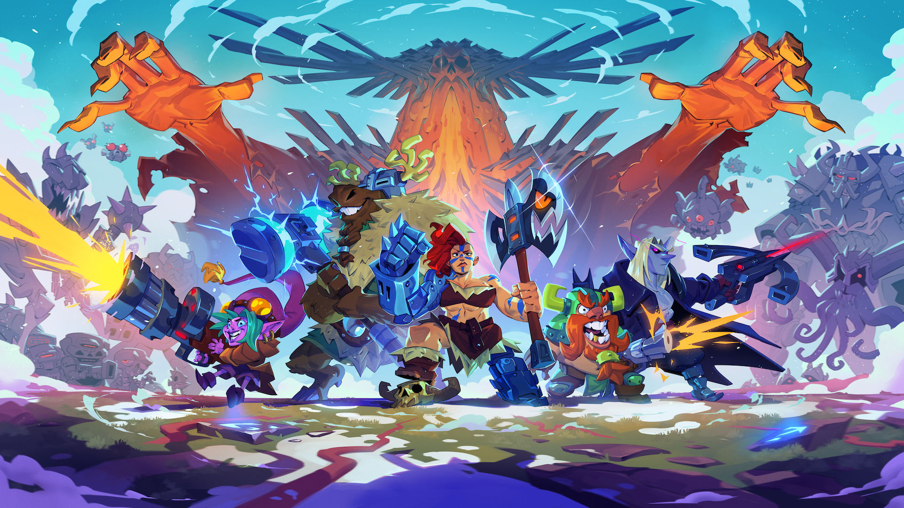
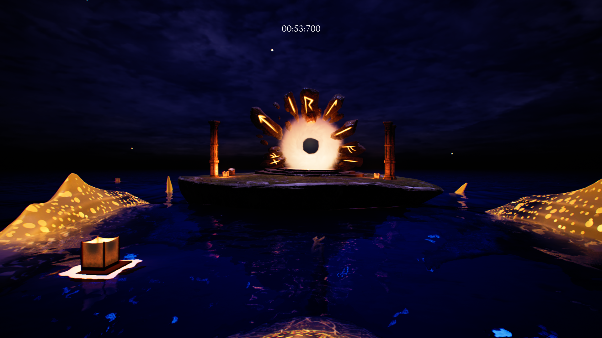
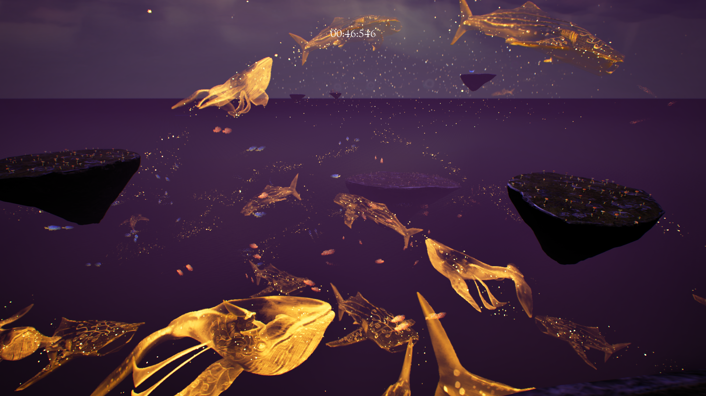
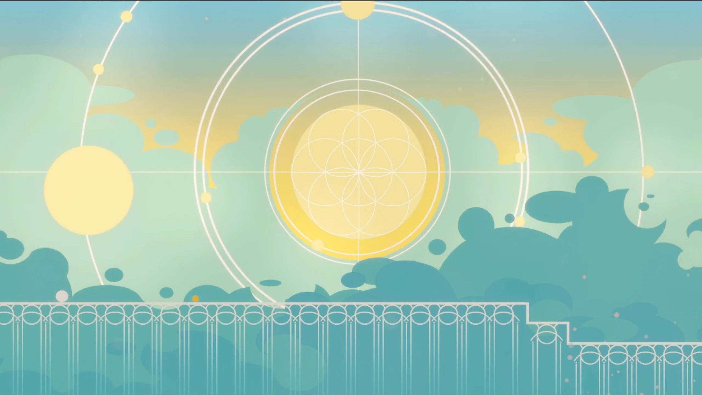
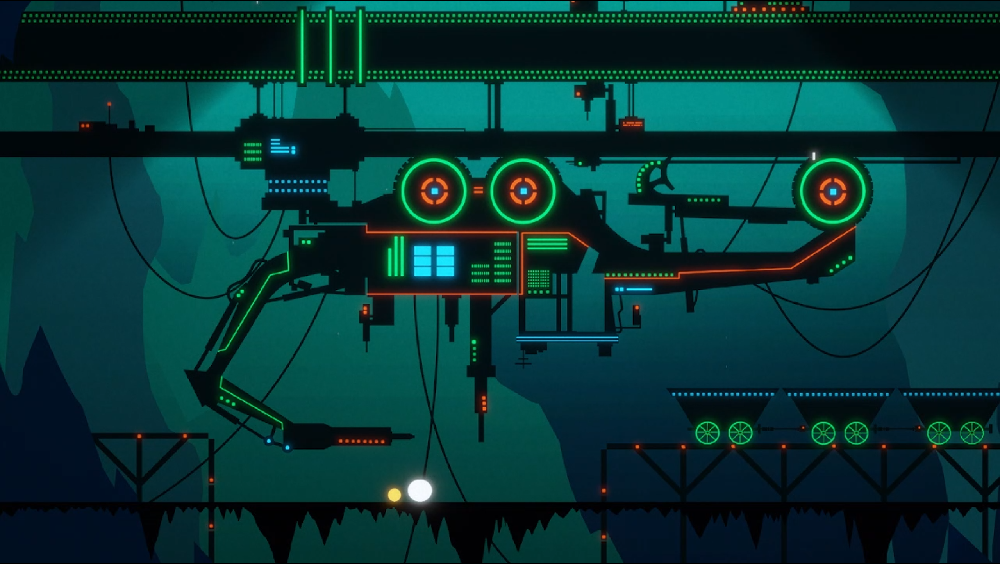
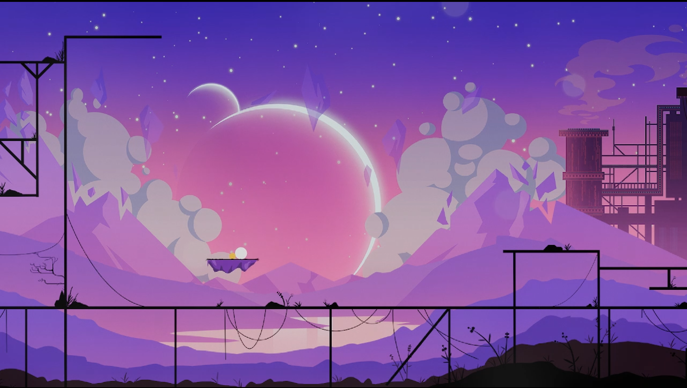
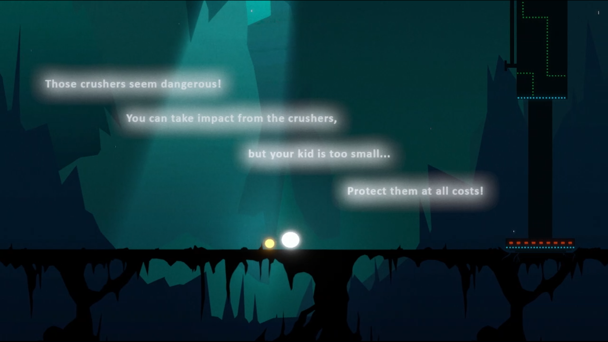
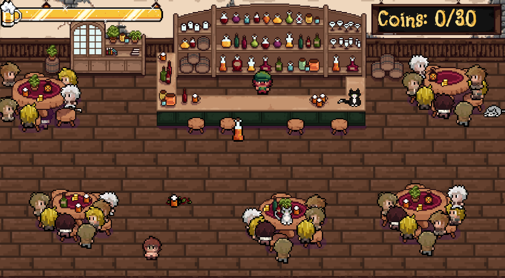
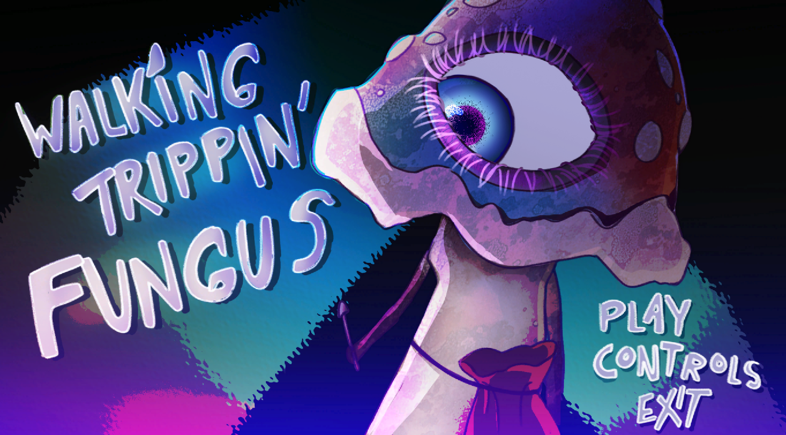

# **Erik Forssell Portfolio**
An overview of the bigger games i've made/worked on.
 
Click on the title of each game for more info.

# Games (professional/intern):
## [Odinfall](https://store.steampowered.com/app/2154240/Odinfall)
worked on: 2024 december - current
 
Engine: Gamemaker
 
Genre: Rogue-lite, Twin-stick shooter

 
 
 

# Games (student):

## [Starlit Seas](StarlitSeas/README.md) <-- Click for more details!
Developed: 2024 April - 2024 June 
 
Engine: Unreal Engine 5.3
 
Genre: Platformer, First-Person, Fantasy

 
 
 
## [Parenthood](Parenthood/README.md) <-- Click for more details!
Developed: 2023 November - 2024 January 
 
Engine: Unity
 
Genre: Platformer, Atmospheric, Walking Simulator

 
 

 

## Smaller Games

Kabooze

 
Engine: Unity
 
Genre: Arcade
 
Made in about 3 days.
 
My first project ever in a group. Quite proud of it considering how new i was to programming.

Walking Trippin Fungus

 
Engine: Unity
 
Genre: Arcade
 
Made in about 3 days.
 
My second project ever in a group. Really overscoped making it not the best but still fun to make and i learned quite a bit.

