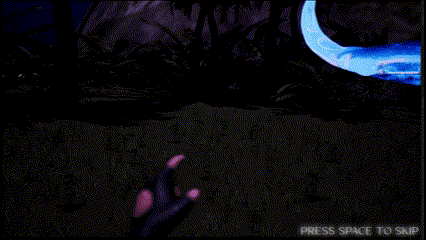
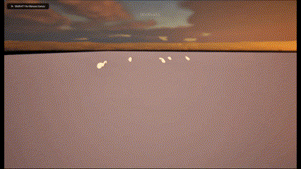
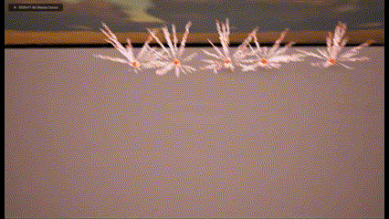
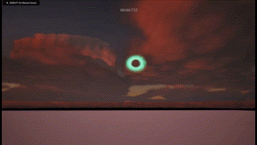

# Starlit Seas

 [Itch.io](https://yrgo-game-creator.itch.io/starlit-seas)

 

## Game description
Starlit Seas is a atmospheric 3D platformer where you play as a lost soul finding their way up to heaven with the guidance of whale spirits.

 

# My contributions during development

## The whales path
The whales ended up being the most complicated part for me.
  
The idea is simple. A simple "AI" that moves along a route 
  
but can still move around said routes to make it feel natural.
  

|The initial idea|       |
|------|------|
|At the beginning the initial thought was the Unreal Engines built in AI! There was a problem with this. The AI required a nav mesh that only registers the potential path on solid ground.   I didn't manage to find any previous example of the built in Ai in the air either.   Having a invisible ground instead didn't give the flexibilty that i wanted either.|  (i didn't have the correct whale model yet)|
|An alternative|       | 
|Instead of using actual AI, i decided to use splines to have more control over the whales.  To make it more natural feeling i decided to make a system so that the whales could switch between different  splines/routes seamlessly. Although i tried my best and got it to work 95% of times, there were enough bugs,   too many tasks left and barely any time to complete it. |     (first version of this system)|
|The final method|       |
|In the end i decided to just keep the whales on splines without anything extra added.   There were many more smaller ideas i tried to implement but none added anything substantial.   While this is disappointing of course, there wasn't enough time.| (The whales following a splines) (the amount of different versions of whales)|

List of smaller things i did on the whales

1. The blowhole boost that sprays water that also launches the player

2. Animation retargeting

3. Lots of collision troubleshooting

Links to Whale blueprints:
[WhaleParent](https://blueprintue.com/blueprint/wnxxdpmd/)
[WhaleShark](https://blueprintue.com/blueprint/rpadtoge/)
[BlowholeWhale](https://blueprintue.com/blueprint/ux194k_4/)

## 

## The Intro cinematic
Due to high pressure that was on the artist already i decided
  
to take the task upon myself and experiment with the cinecam in UE.
  
Although i'm somewhat happy with the result, it's not perfect and i
  
didn't have time to make it much better
  

|Where to begin?|       |
|------|------|
|I wanted to make the first person POV have realistic movement. And instead of animating every frame by hand, i found this app called CamTrackAR   This app made it so that i could track the movement of my phone by placing anchor points along the ground when filming leading to somewhat natural head movement. ||
|The Animation|       | 
|As for the animation where i wanted the hands to show as the player wakes up in a foreign place, i took a mixamo animation. The Skeletal mesh i got from the artist wasn't compatible though so i had to retarget the player SM to the mixamo SM.|    |       |
|Blinking|       | 
|I also wanted to add some blinking so that it really feels like you've just woken up. I made a material that looks like the eyelids around the camera and applied it to a post process component that was attached to the skeletal mesh. Finally i added a variable that i could change wherever that changed the sphere mask making it seem as if the eyelids closed and opened.| |
|The Final Product|       | 
|Finally i put it all together and it looks like this:    It's a bit longer and better looking in the actual game.| |

Links to relevant blueprints:
[BlinkingMaterial](https://blueprintue.com/blueprint/c5bvtwnn/)
[BlinkingBlueprint](https://blueprintue.com/blueprint/33l218--/)

##

## Jellyfish Enemies
During development we realised that some type of obstacle is needed.
  
One of the other programmers had made a jellyfish looking ribbon visual effect
  
but we weren't sure what to do with it. So i decided to take it upon myself 
  
to make an enemy out of it.
  

|The straight forward approach|       |
|------|------|
|To begin with i simply wanted to try to make the jellyfish just follow you so that when it gets too close the player takes damage much like many other enemies in games. ||
|Adding electricity|       | 
|The flaw with the previous method was that in a dark open sky it started getting quite hard to see where the enemies are and how close they actually were. To try to make them more visible i decided to add lightning around the jellyfish.|    |       |
|Changing it up|       | 
|Although the lightning did help it still didn't feel like it fit into the game we were trying to make and the play testers agreed. To combat this, instead of making a sort of approaching enemy, i decided to recycle the jellyfish into more of a immovable obstacle instead. Now they move in a pattern with lightning between each other making different type of shapes depending on how i structure the paths. I also added so that they spin faster the closer you get.| |

Links to relevant blueprints:
[Jellyfish_01](https://blueprintue.com/blueprint/a53mtjgq/)
[JellyfishElectricity](https://blueprintue.com/blueprint/wv68_grw/)
[Jellyfish_02](https://blueprintue.com/blueprint/e8uqgz5r/)

##

## List of smaller things i did

Boost Ring

 

Fog

 

Scanning

  As a fun little end credits joke i suggested to the group to scan   everyone in dumb poses and put ourselves inside the game using polycam   (I'm the one by the computer)

Omptimization

due to lack of perfomance i tried to optimize as much as possible with foliage reduction, culling, LOD, nanite and so on.

