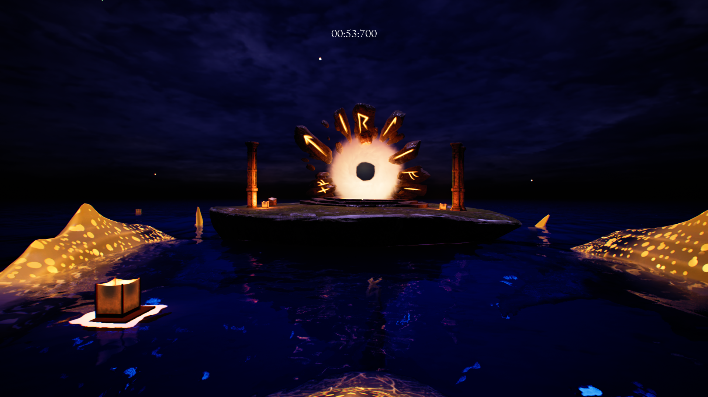

# Starlit Seas

 [Itch.io](https://yrgo-game-creator.itch.io/starlit-seas)

 

## Game description
Starlit Seas is a atmospheric 3D platformer where you play as a lost soul finding their way up to heaven with the guidance of whale spirits.

 

# My contributions during development

## The whales path
The whales ended up being the most complicated part for me.
  
The idea is simple. A simple "AI" that moves along a route 
  
but can still move around said routes to make it feel natural.
  

### The initial idea
At the beginning the initial thought was the Unreal Engines built in AI!
  
There was a problem with this. The AI required a nav mesh that only registers the potential path
  
on solid ground. I didn't manage to find any previous example of the built in Ai in the air either.
  
Having a invisible ground instead didn't give enough flexibilty that i wanted.
